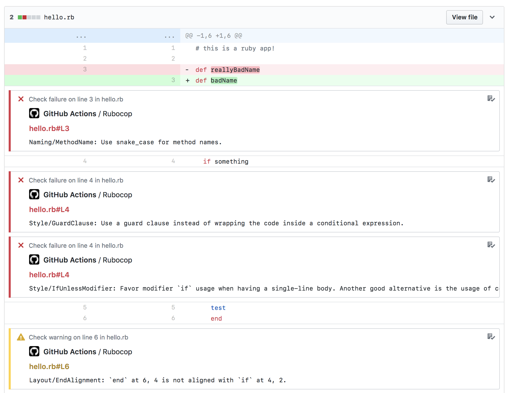

# Rubocop Action

Lint your Ruby code in parallel to your builds



## Setup

Add the following to your workflow file to install `rubocop-action`

```
- name: Rubocop checks
  uses: gimenete/rubocop-action@1.0
  env:
    GITHUB_TOKEN: ${{ secrets.GITHUB_TOKEN }}
    
```
